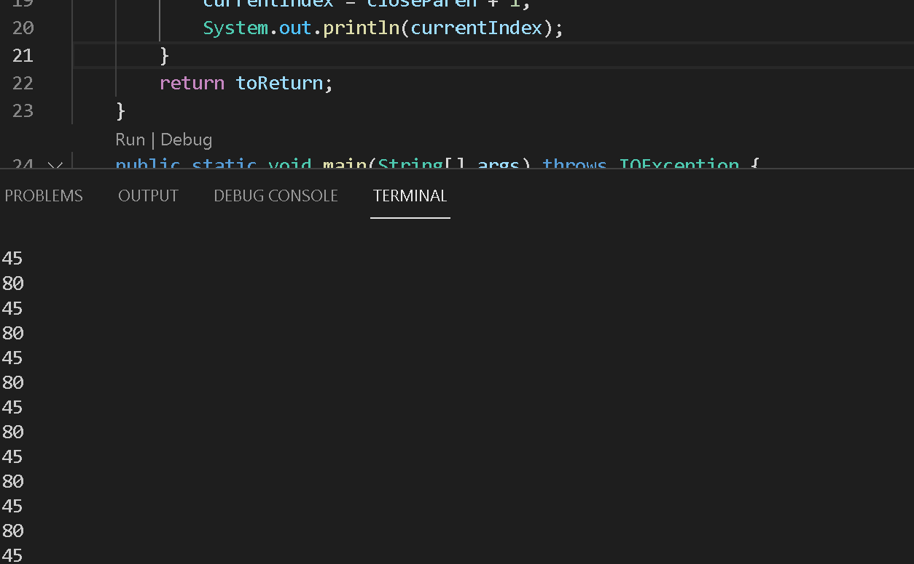

# CSE 15L
## Week 4 Lab Report 2
\
In this Lab Report, we are trying to debug the code pick three code changes that my group worked in labs 3 and 4.
### The first bug
---

[Test File](Markdown3.md)
